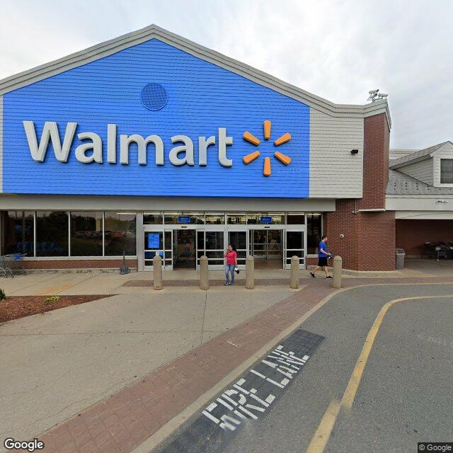

# USA Street View Batch CSV to Image Downloader

A Python program that takes USA addresses in a CSV file and downloads the corresponding Google Street View image.

[Click Here for a more in-depth article on how this works](https://medium.com/@polish.greg/using-python-to-download-google-street-view-images-d63bcd5030e)

## Requirements

- Python 3
- tqdm

## Setup

1. Clone this repository
2. Install the required packages: `pip install -r requirements.txt`
3. Acquire a Google streetview API key
4. Your key needs to be in a text file you create located in `../k.txt` one directory above the location of the main python script `map_no_gui.py`
5. The `data` folder is for the `address.csv` file you will be wanting to get streetview images of
6. Make sure your CSV addresses are formatted correctly. `example.csv` provides the correct formatting
7. The file in the data folder must be named `address.csv`
8. The `output` folder will be where your .jpg streetview files will be output

## Usage

1. Run the script: `python3 map_no_gui.py`
2. This script uses multiprocessing, so it has two options for speed, fast or slow. slow uses only 2 processes, while fast uses 32
3. You also have the option to remove all files in the output directory for a fresh run
4. The Street View image will be saved in the `output` directory
